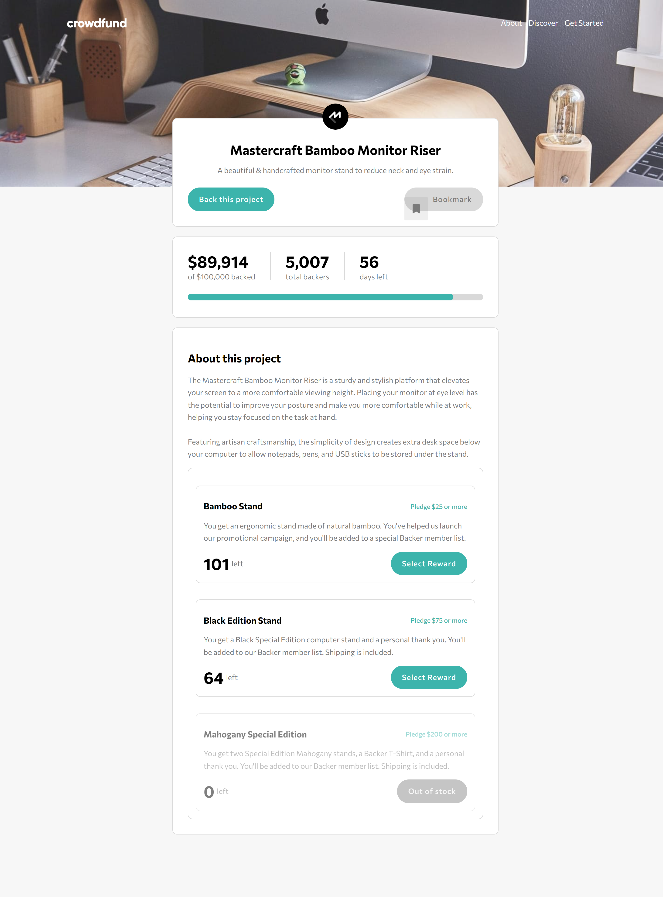
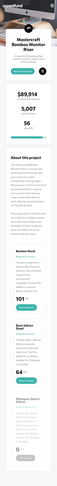

# Frontend Mentor - Crowdfunding product page solution

This is a solution to the [Crowdfunding product page challenge on Frontend Mentor](https://www.frontendmentor.io/challenges/crowdfunding-product-page-7uvcZe7ZR). Frontend Mentor challenges help you improve your coding skills by building realistic projects.

## Table of contents

- [Overview](#overview)
  - [The challenge](#the-challenge)
  - [Screenshot](#screenshot)
  - [Links](#links)
- [My process](#my-process)
  - [Built with](#built-with)
  - [What I learned](#what-i-learned)
  - [Continued development](#continued-development)
  - [Useful resources](#useful-resources)
- [Author](#author)

**Note: Delete this note and update the table of contents based on what sections you keep.**

## Overview

### The challenge

Users should be able to:

- View the optimal layout depending on their device's screen size
- See hover states for interactive elements
- Make a selection of which pledge to make
- See an updated progress bar and total money raised based on their pledge total after confirming a pledge
- See the number of total backers increment by one after confirming a pledge
- Toggle whether or not the product is bookmarked

### Screenshot

;


### Links

- You can see [my solution here](https://www.frontendmentor.io/solutions/tip-calculator-app-gKJCg6ZXJR)
- View the [live site demo here](https://crowdfunding-product-page-mu-six.vercel.app/)

## My process

### Built with

- Semantic HTML5 markup
- SCSS custom properties
- Flexbox
- CSS Grid
- Desktop-first workflow
- [React](https://reactjs.org/) - JS library
- [SASS (.scss)](https://sass-lang.com/) - CSS Preprocessor for styles
- [React Context](https://legacy.reactjs.org/docs/context.html) + [useReducer](https://react.dev/reference/react/useReducer) - For state management

### What I learned

I figured a better way to use `context` to manage state. Instead of importing `useContext` for every component I want to use it, I just create a function to call `useContext(context)`, which returns an object with the needed state data in the `context.jsx` file right outside after the `ContextProvider` component.

_Here's an example_

```jsx
import { createContext, useContext } from "react";
import { reducer } from "../reducer";
const ProjectsContext = createContext();

const ContextProvider = ({ children }) => {
  const initialState = {
    // initial state here
  };

  const [state, dispatch] = useReducer(reducer, initialState);

  return (
    <Context.Provider value={{ state, dispatch }}>{children}</Context.Provider>
  );
};

function getContextValues() {
  return useContext(Context);
}

// export provider and funtion that gets provider values with useContext()
export { ContextProvider, getContextValues };
```

### Continued development

I know that I should not be managing all my state in one context. It just felt easier and straight forward to do. In future projects, I intend to use other state mangament libraries like 'React Redux toolkit' or 'Zustand' so I can get familiar with them and know which one feels more intuitive for me to manage state with.

### Useful resources

- [Tutorialspoint | how to set the color of progress bar using html and css](https://www.tutorialspoint.com/how-to-set-color-of-progress-bar-using-html-and-css) - This helped me figure out how to style the 'total amount' progress bar.

## Author

<!-- - LinkedIn - [](https://www.your-site.com) -->

- Frontend Mentor - [@brown-ctrl](https://www.frontendmentor.io/profile/brown-ctrl)
- Twitter - [@memoye_io](https://www.twitter.com/memoye_io)

<!--
## Acknowledgments

This is where you can give a hat tip to anyone who helped you out on this project. Perhaps you worked in a team or got some inspiration from someone else's solution. This is the perfect place to give them some credit.

**Note: Delete this note and edit this section's content as necessary. If you completed this challenge by yourself, feel free to delete this section entirely.** -->
